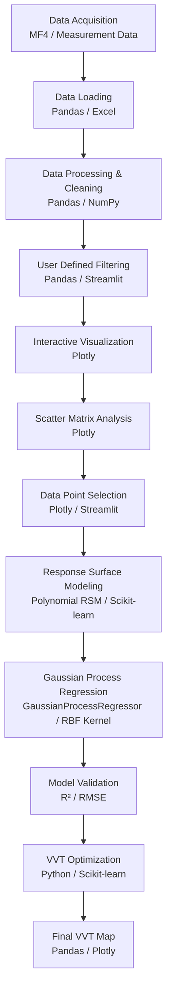

## 🔄 Analysis Workflow

## 🛠️ Analysis Modules

| Module | Tools / Methods |
|---|---|
| Data Acquisition | MF4 / Measurement Data |
| Data Loading | Pandas / Excel |
| Data Processing & Cleaning | Pandas / NumPy |
| User Defined Filtering | Pandas / Streamlit |
| Interactive Visualization | Plotly |
| Scatter Matrix Analysis | Plotly |
| Data Point Selection | Plotly / Streamlit |
| Response Surface Modeling | Polynomial RSM / Scikit-learn |
| Gaussian Process Regression | GaussianProcessRegressor / RBF Kernel |
| Model Validation | R² / RMSE |
| VVT Optimization | Python / Scikit-learn |
| Final VVT Map | Pandas / Plotly |

